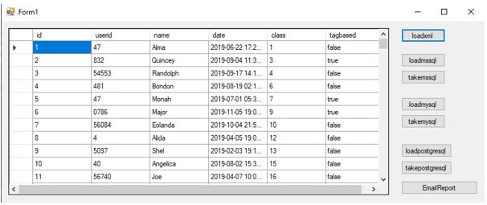
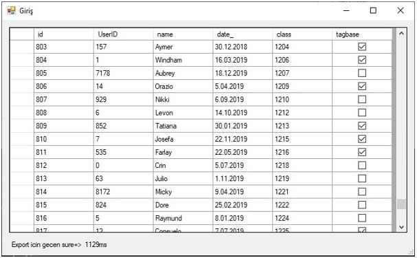
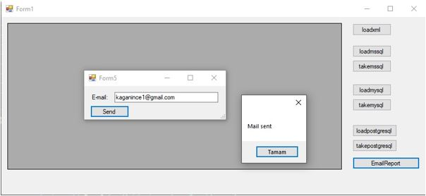

## Database Comparison using C# - MSSQL - MYSQL - POSTGRESQL

Mssql, mysql and postgresql comparison application using C#. Loading data from xml and load and take datas from databases. Then it gives a report execution time to your email.

Mssql, mysql ve postgresql C# kullanarak karşılaştırma uygulaması. Xml'den veri yükleyerek ve verileri veri tabanlarına yükleyip tekrar çekme işlemlerini yapar. Ardından e-postanıza geçen süreleri mail olarak atar.

  

In this screen you can load datas from xml. There are 10.000 datas in this file.

Bu ekranda xml'den veri yükleyebilirsiniz. Bu dosyada 10.000 veri bulunmaktadır.

  

In this screen you can load and take datas from databases. You can see execution time on the bottom left of application.

Bu ekranda veri tabanlarından veri yükleyebilir ve alabilirsiniz. Yürütme süresini uygulamanın sol alt köşesinde görebilirsiniz.

  

You can receive execution report when you enter your email adress.

E-posta adresinizi girdiğinizde çalışma süresinin raporunu alabilirsiniz.
